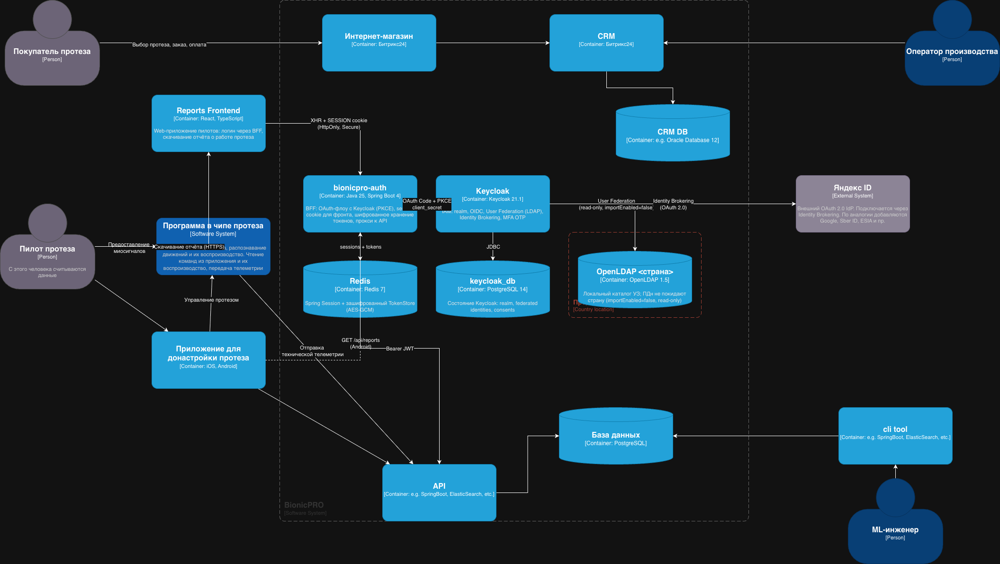

## Subtask 1

C4-диаграмма для управления учётными данными в BionicPRO после доработки.

### Что добавилось в систему

| Контейнер              | Стек                   | Назначение                                                                                        |
|------------------------|------------------------|---------------------------------------------------------------------------------------------------|
| `bionicpro-auth` (BFF) | Java 25, Spring Boot 4 | OAuth-флоу с Keycloak, шифрованное хранение токенов, сессионная cookie для фронта, прокси к `API` |
| `Keycloak`             | Keycloak 21.1          | IAM: federation, identity brokering, MFA (OTP)                                                    |
| `Redis`                | Redis 7                | Spring Session + зашифрованный TokenStore                                                         |
| `OpenLDAP <страна>`    | OpenLDAP 1.5           | Локальный каталог учёток пилотов конкретной страны представительства                              |
| `keycloak_db`          | PostgreSQL 14          | Состояние Keycloak (realm, brokered identities, consents)                                         |
| `Яндекс ID` (внешний)  | OAuth 2.0              | Внешний IdP через Identity Brokering                                                              |

### Как закрываются требования задания

1. **Унификация доступа через внешний источник в стране представительства.**
   Каждое представительство держит свой `OpenLDAP <страна>` — например `OpenLDAP RU`,
   `OpenLDAP DE`. Keycloak подключается к ним через User Federation
   c `importEnabled=false`: ПДн пилотов **физически остаются в LDAP**,
   в БД Keycloak не копируются. Read-only режим федерации запрещает
   запись данных обратно.

2. **Токены не попадают на фронт.**
   `bionicpro-auth` (BFF) — единственный, кто общается с Keycloak по OAuth.
   После обмена code на токены он шифрует access + refresh AES-GCM ключом
   и кладёт в Redis под session_id. В браузер уходит только HttpOnly+Secure
   cookie `SESSION=<id>`. При обращениях к API BFF сам подкладывает Bearer.

3. **Несколько внешних удостоверяющих служб.**
   Identity Brokering в Keycloak позволяет подключить любое количество IdP
   (OIDC/OAuth/SAML). В этом спринте подключён Яндекс ID. Аналогично
   подключаются Google, Sber ID, ESIA и т.д. — без изменений на фронте и
   в BFF.

### Файл диаграммы

### Элементы для drawio

Сохранены прежние компоненты:
* Покупатель протеза, Пилот протеза, Оператор производства, ML-инженер (Person)
* Интернет-магазин (Битрикс24), CRM (Битрикс24), CRM DB (Oracle)
* Программа в чипе протеза (Software System)
* Приложение для донастройки протеза (iOS, Android)
* API (SpringBoot), База данных (PostgreSQL), cli tool

Добавлены:
* **bionicpro-auth** (Container, SpringBoot) — внутри BionicPRO boundary
* **Keycloak** (Container, IAM) — внутри BionicPRO boundary
* **keycloak_db** (Container, PostgreSQL) — внутри BionicPRO boundary
* **Redis** (Container) — внутри BionicPRO boundary
* **OpenLDAP RU** (Container) — внутри boundary "Представительство РФ"
* **OpenLDAP DE** (Container, опционально) — внутри boundary "Представительство ФРГ"
* **Яндекс ID** (External System) — снаружи BionicPRO boundary
* **Reports Frontend** (Container, React) — внутри BionicPRO boundary

Стрелки (новые):
* Browser ──► Reports Frontend (HTTPS)
* Reports Frontend ──► bionicpro-auth (XHR + cookie)
* bionicpro-auth ──► Keycloak (OAuth Code + PKCE, client_secret)
* bionicpro-auth ──► Redis (sessions, encrypted tokens)
* bionicpro-auth ──► API (Bearer JWT)
* Keycloak ──► keycloak_db (JDBC)
* Keycloak ──► OpenLDAP RU/DE (User Federation, read-only)
* Keycloak ──► Яндекс ID (Identity Brokering, OAuth 2.0)
* Приложение для донастройки протеза ──► bionicpro-auth (как новый клиент BFF)
