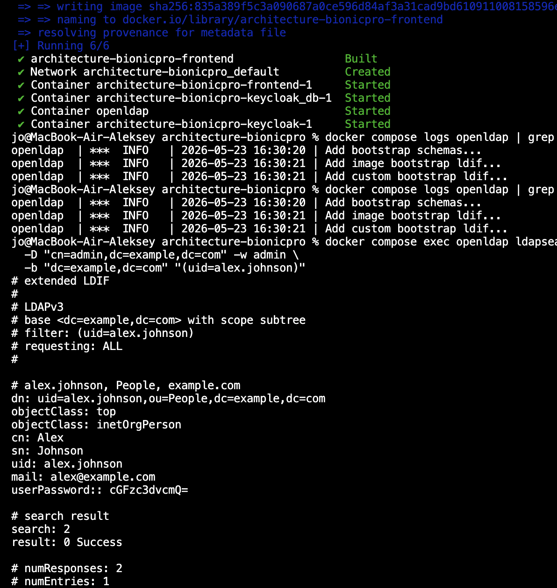
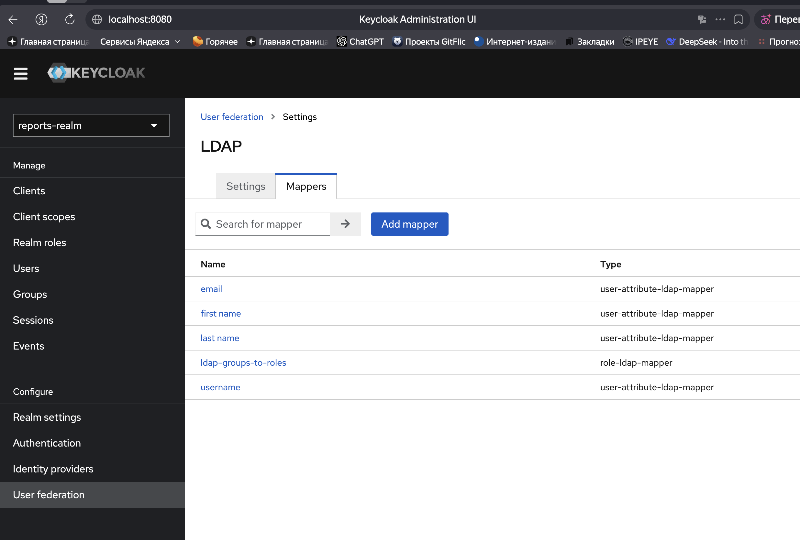
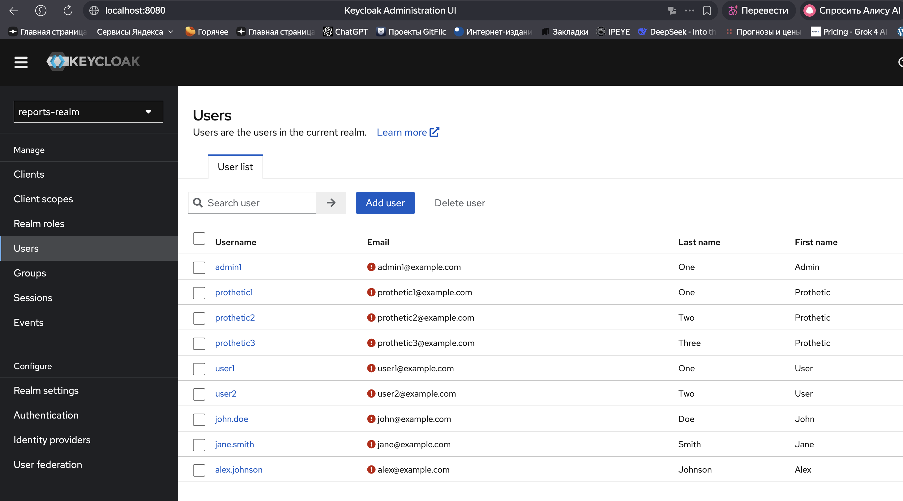
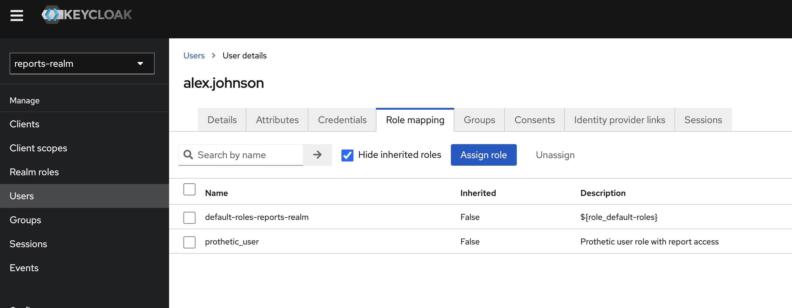

## Subtask 4

Начал с 4 подзадания, доработал конфиги, запустил докер:

в User Federation 5 штук Mappers:

Видны и старые юзеры из realm:

Юзеру alex.johnson назначена realm-роль prothetic_user:

Цепочка работает:

OpenLDAP:
* cn=prothetic_user
* member: alex.johnson
* member: john.doe

Keycloak:
* realm role: prothetic_user
* alex.johnson (federated) 

