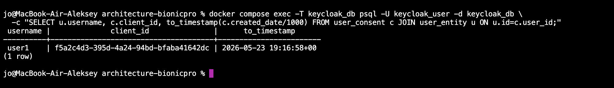

## Subtask 5

OTP подключал через `requiredActions` + дефолтный browser flow Keycloak.
Кастомный auth flow пробовал — сломал Admin UI (NPE на null built-in flows), откатил.

В [realm-export.json](../keycloak/realm-export.json) добавил:

- OTP-политику на realm-уровне (TOTP, SHA1, 6 цифр, 30 сек, без переиспользования кода)
- realm-level `requiredActions` с `CONFIGURE_TOTP` и `defaultAction: true` —
  чтобы новые юзеры автоматом получали required action
- каждому из 6 realm-юзеров `"requiredActions": ["CONFIGURE_TOTP"]` —
  для уже существующих

Как работает: при первом логине Keycloak видит required action, форсит
настройку OTP (QR-код), снимает required action. На последующих логинах
встроенный Browser - Conditional OTP видит credential и требует код.

Сканировал QR в Google Authenticator, ввёл код:

### Ограничение по LDAP-юзерам

Для LDAP-федерации с `importEnabled: false` юзеры не лежат в БД Keycloak,
поэтому `requiredActions` им так просто не присвоить. Варианты:
- включить `importEnabled: true` — ломает data sovereignty из Task 4
- кастомный browser flow без conditional check — ломал Admin UI
- скрипт через kcadm.sh на старте контейнера

Оставлен как осознанный компромисс.
