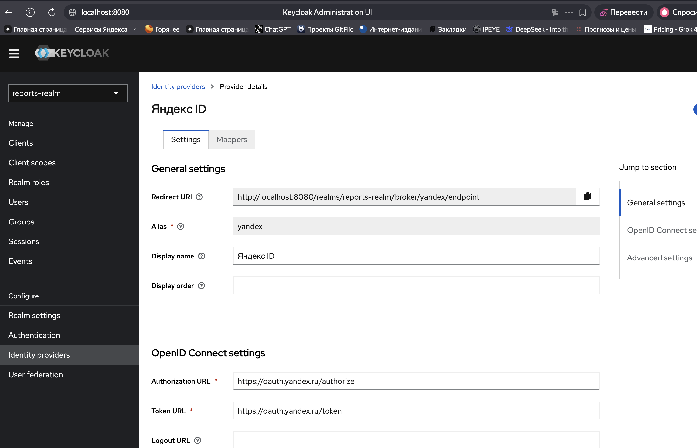
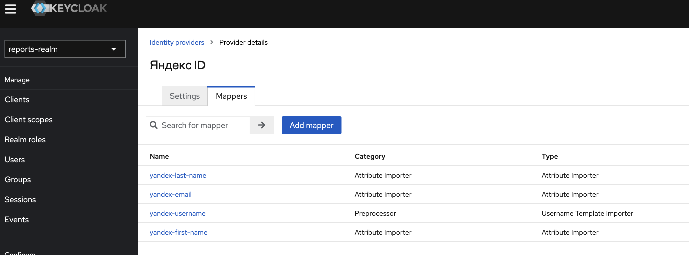
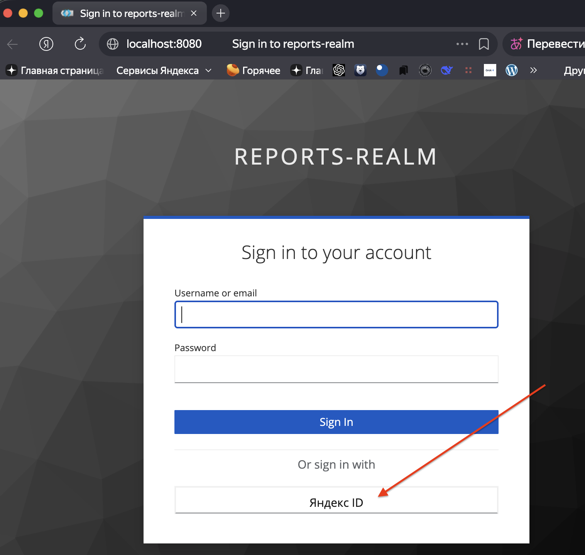
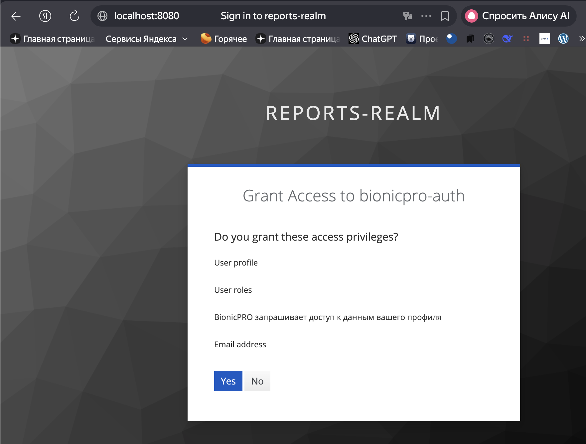

Конфиг IdP
[realm-export.json](../keycloak/realm-export.json)

Скриншот вкладки Identity Providers

Скриншот вкладки Mappers

Скриншот страницы логина с кнопкой "Яндекс ID"

Скриншот consent screen

SQL-выдача по user_consent

интеграция с Яндексом подтверждена структурно; для полного E2E теста нужна регистрация приложения с redirect_uri = http://localhost:8080/realms/reports-realm/broker/yandex/endpoint

