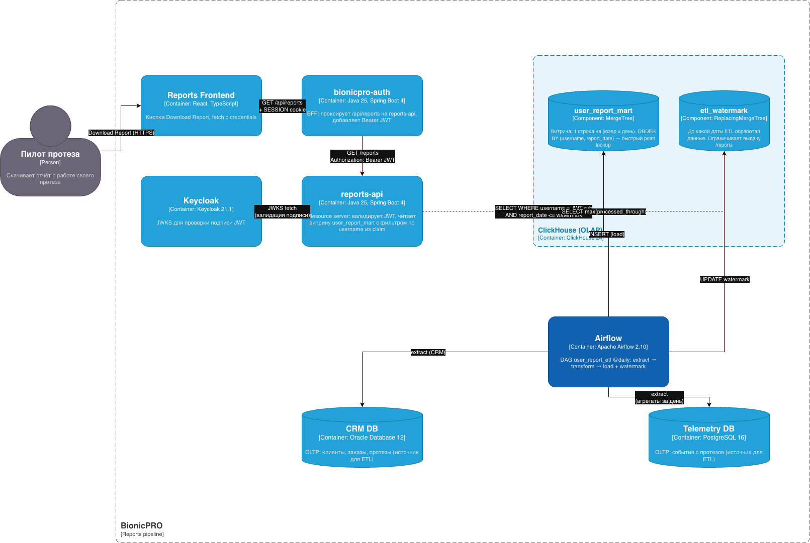

## Subtask 1

Архитектура pipeline'а отчётов.

### Новые контейнеры

| Контейнер | Стек | Назначение |
|---|---|---|
| `ClickHouse` | ClickHouse 24 | OLAP-хранилище, витрина `user_report_mart` + `etl_watermark` |
| `Airflow` | Apache Airflow 2.10 | Оркестратор DAG'а `user_report_etl` |
| `source-db` | PostgreSQL 16 | Мок CRM + Telemetry в двух схемах (в реальности — два независимых источника) |
| `reports-api` | Java 25, Spring Boot 4 | Resource server, читает витрину, валидирует JWT |

### Как закрываются требования задания

1. **ETL CRM + DB → OLAP через Airflow.**
   DAG `user_report_etl` со schedule `@daily` извлекает CRM-сущности и
   агрегаты телеметрии за день, джойнит и грузит одним `INSERT` в
   `user_report_mart`. После успеха обновляет `etl_watermark`.

2. **Витрина быстрая по юзерам.**
   `MergeTree ORDER BY (username, report_date) PARTITION BY toYYYYMM(report_date)`
   — фильтр по username отсекает основную массу parts, по дате — partition pruning.
   `LowCardinality(String)` на справочниках уменьшает объём.

3. **API `/reports`.**
   `reports-api` — отдельный Spring Boot сервис, NOT BFF.
   Принимает только JWT, фильтрует выдачу по `preferred_username` из claim.

4. **Не отдаём данные, которых ещё нет.**
   На каждый запрос `reports-api` сначала читает `etl_watermark`,
   ограничивает `report_date <= watermark`.

### Файл диаграммы

