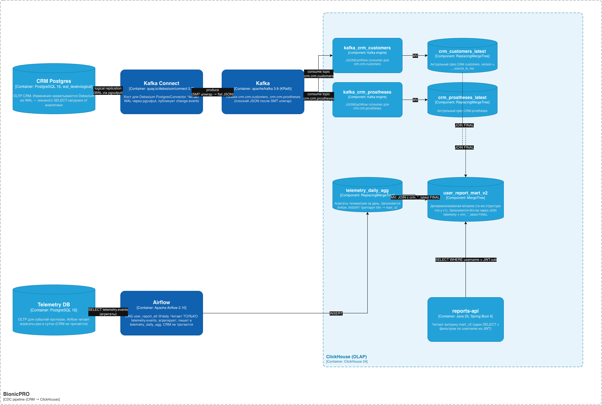

# Задание 4. Повышение оперативности и стабильности работы CRM

Спринт 9 курса "Архитектор ПО" по кейсу BionicPRO. После запуска отчётов
из Task 2 ETL ходил в CRM-Postgres ежедневным SELECT'ом массовых выгрузок —
это тормозило OLTP-операции в самой CRM. Здесь меняем pull-ETL на
streaming **CDC через Debezium**: изменения CRM приходят из WAL Postgres
в Kafka, ClickHouse подхватывает их через KafkaEngine и поддерживает
актуальное состояние витрины через MaterializedView.

Airflow теперь дёргает только агрегаты телеметрии (отдельная БД),
CRM не трогает.

## Схема компонентов C4



## Что сделано

| # | Подзадача | Артефакт |
|---|---|---|
| 1 | Postgres logical replication + REPLICA IDENTITY FULL | [`subtask1.MD`](subtask1.MD) |
| 2 | Kafka (KRaft) + Kafka Connect + регистрация коннектора | [`subtask2.MD`](subtask2.MD) |
| 3 | Debezium connector конфиг | [`subtask3.MD`](subtask3.MD) |
| 4 | ClickHouse: KafkaEngine + MV → новая витрина `user_report_mart_v2` | [`subtask4.MD`](subtask4.MD) |
| 5 | Airflow только телеметрия, reports-api на `user_report_mart_v2` | [`subtask5.MD`](subtask5.MD) |

## Ключевые решения

- **Logical replication через pgoutput.** Plug-in `pgoutput` встроен
  в Postgres 16, ничего ставить не надо. На уровне таблиц —
  `REPLICA IDENTITY FULL`, чтобы в WAL писались все колонки строки
  (а не только PK), иначе Debezium не сможет восстановить `before`
  для UPDATE/DELETE.

- **Kafka в KRaft-режиме без Zookeeper.** Один контейнер
  `apache/kafka:3.8.0`. Это упрощает топологию — нет отдельного ZK.

- **Debezium с `ExtractNewRecordState` SMT.** По умолчанию Debezium
  оборачивает каждое событие в envelope `{before, after, op, source}`.
  SMT `unwrap` распаковывает: в Kafka летит плоский JSON со строкой
  `after`, а флаг операции добавляется как `__op` через `add.fields`.
  Так ClickHouse Kafka engine может работать с обычным `JSONEachRow`
  без вложенных структур.

- **ReplacingMergeTree(version) для актуального среза CRM.**
  `crm_customers_latest` и `crm_prostheses_latest` используют
  `__source_ts_ms` как version. С `FINAL` в запросе получаем последнюю
  версию по каждому PK — простая идемпотентность даже при дублях.

- **JOIN в MaterializedView.** `mv_telemetry_to_mart_v2` срабатывает
  на INSERT в `telemetry_daily_agg` и тут же делает JOIN с
  `crm_*_latest FINAL`, кладёт результат в денормализованную витрину
  `user_report_mart_v2`. Так CRM-данные актуальны на момент построения
  витрины, без отдельного JOIN-кода в Airflow.

- **Чистое разделение нагрузки.** OLTP-инстанс CRM теперь читается
  **только** репликой WAL (write-heavy load это не аффектит), а
  запросы аналитики идут в ClickHouse.

## Где что лежит в репозитории

- [`docker-compose.yaml`](../docker-compose.yaml) — добавлены сервисы
  `kafka`, `kafka-connect`, `kafka-connect-init`; у `source-db` команда
  с `wal_level=logical`
- [`source-db/init.sql`](../source-db/init.sql) — `ALTER TABLE ... REPLICA IDENTITY FULL`
- [`debezium/crm-connector.json`](../debezium/crm-connector.json) —
  конфиг Debezium PostgresConnector
- [`clickhouse/02-cdc.sql`](../clickhouse/02-cdc.sql) — Kafka engine,
  MV chain, новая витрина `user_report_mart_v2`
- [`airflow/dags/user_report_etl.py`](../airflow/dags/user_report_etl.py)
  — DAG больше не ходит в CRM, только агрегирует телеметрию
- [`backend/reports-api/.../ReportRepository.java`](../backend/reports-api/src/main/java/com/bionicpro/reports/db/ReportRepository.java)
  — `FROM user_report_mart_v2`

## Поток данных

```
                  CRM Postgres (OLTP, wal_level=logical)
                       │
                       │ WAL (logical replication, pgoutput)
                       ▼
                  Debezium Connector  (внутри Kafka Connect)
                       │ change events (SMT unwrap → flat JSON)
                       ▼
                  Kafka topics
                       ├─ crm.crm.customers
                       └─ crm.crm.prostheses
                       │
                       ▼
                  ClickHouse KafkaEngine
                       ├─ kafka_crm_customers
                       └─ kafka_crm_prostheses
                       │
                       │ Materialized View
                       ▼
                  ReplacingMergeTree (срез CRM)
                       ├─ crm_customers_latest
                       └─ crm_prostheses_latest
                                     ▲
                                     │ JOIN FINAL в MV
                                     │
   telemetry_daily_agg ──MV──► user_report_mart_v2
        ▲                            ▲
        │ INSERT                     │ SELECT
        │ (только агрегаты,          │
        │  без CRM-данных)           │
   Airflow DAG                  reports-api
```
